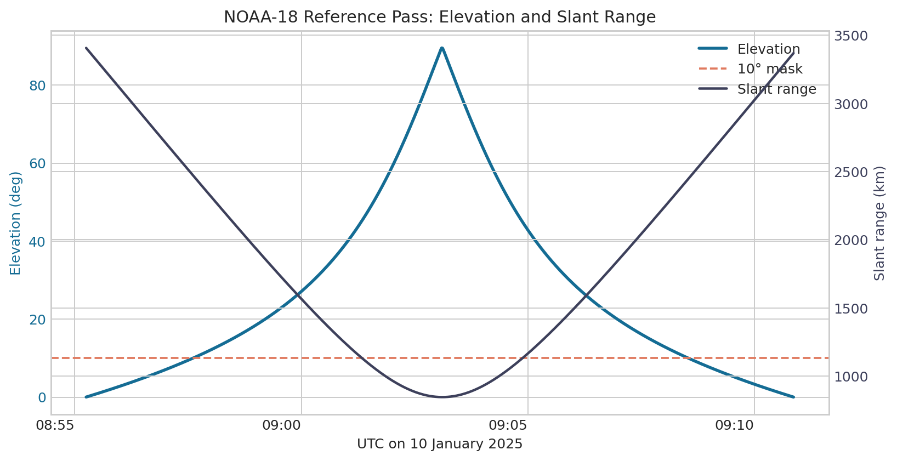
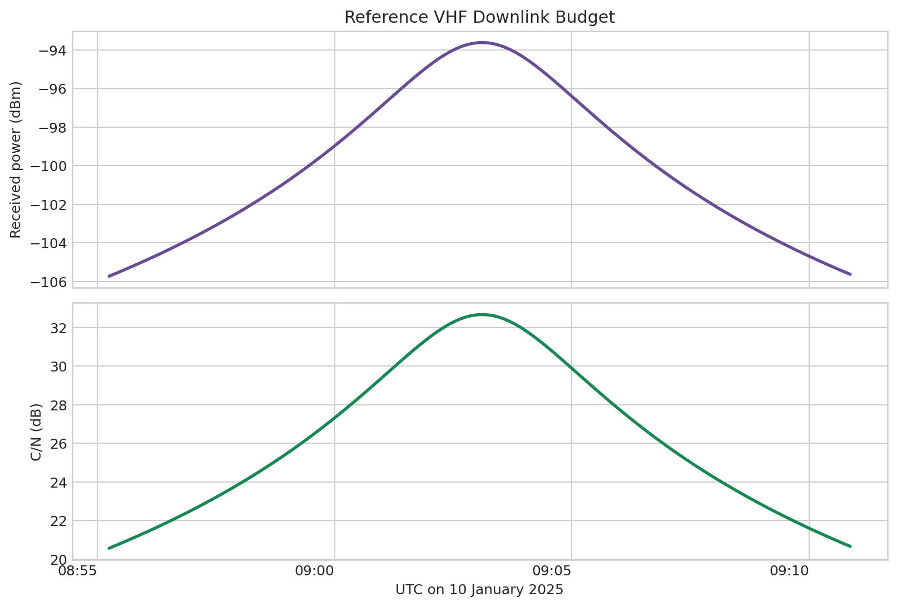
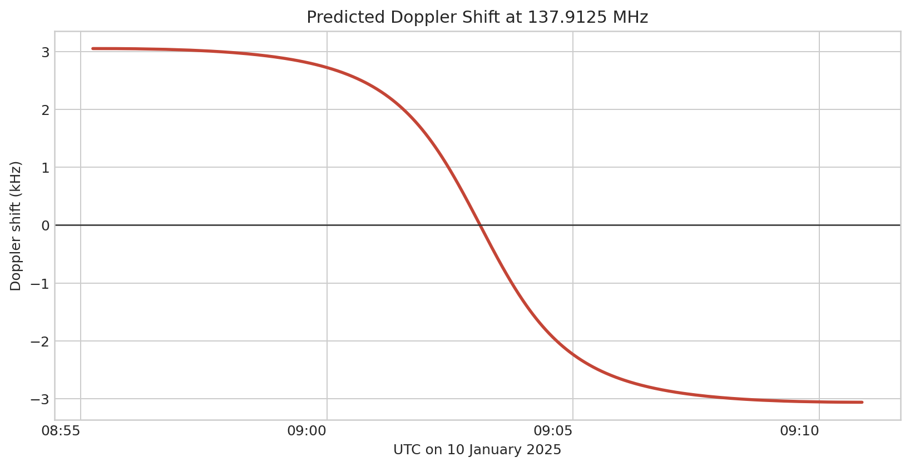
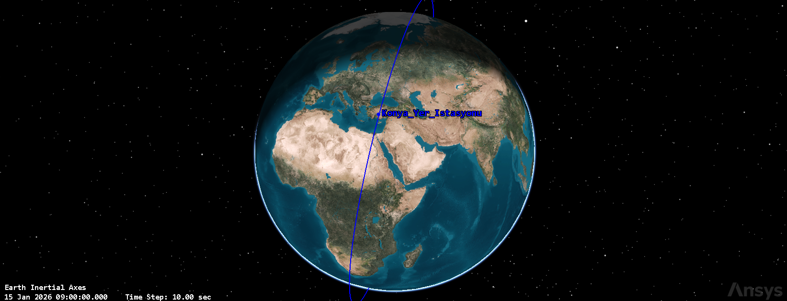
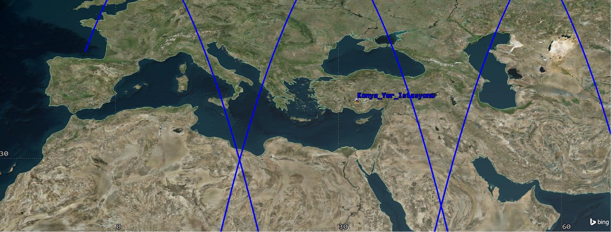
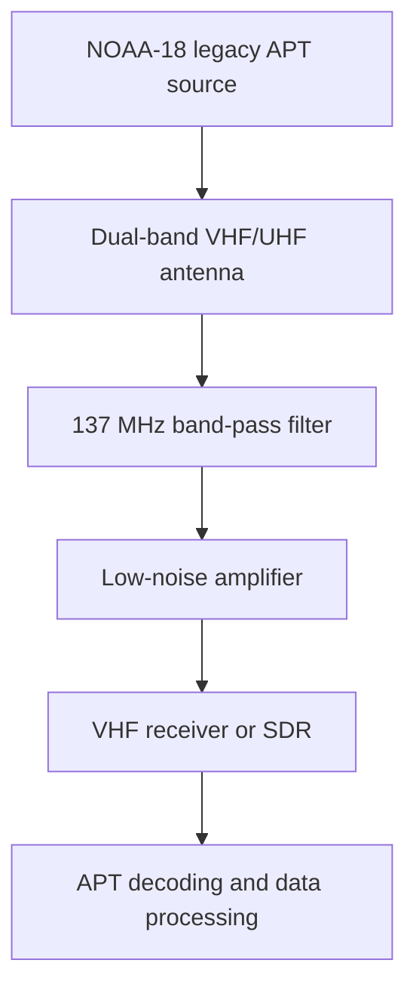

# Dual-Band UHF/VHF Ground Station Design for LEO Satellites

[](https://github.com/nur1091/dual-band-uhf-vhf-leo-ground-station/actions/workflows/validate.yml)

Simulation-supported ground-station architecture and reproducible performance analysis for LEO satellite communication using SGP4, MATLAB and RF link-budget methods.

## Overview

This undergraduate capstone project develops a modular UHF/VHF ground-station concept covering orbital tracking, antenna pointing, receive-chain design and RF performance analysis. A legacy NOAA-18 pass is used as a historical VHF downlink reference case. The original STK concept has been rebuilt as a reproducible workflow using an operational-period TLE, transparent assumptions and source-controlled analysis files.

The repository distinguishes between:

- A 137.9125 MHz analog VHF reference downlink.
- A wider dual-band architecture for mission-dependent uplink and downlink operations.

## Project objectives

- Design a modular ground-station concept for VHF/UHF LEO satellite missions.
- Determine satellite access windows and antenna-pointing requirements from TLE data.
- Evaluate VHF downlink feasibility through received-power, noise and Doppler analysis.
- Define band-compatible RF signal chains for receive and packet-radio transmit operations.
- Produce a transparent and reproducible analysis workflow independent of a proprietary STK licence.

## Engineering scope

- Historical TLE selection and SGP4 propagation
- Azimuth, elevation and slant-range generation
- 0° geometric visibility and 10° preferred elevation masking
- Free-space path loss and received-power calculation
- Receiver noise temperature and carrier-to-noise analysis
- Doppler prediction from slant-range rate
- Band-aware RF architecture and component interfaces
- MATLAB post-processing and repeatable result generation

## Reference pass results

The strongest pass on 10 January 2025 was selected from a 24-hour SGP4 analysis for the NEU Köyceğiz Campus in Konya.

| Metric | Result |
|---|---:|
| Geometric AOS | 08:55:15 UTC |
| Geometric LOS | 09:10:52 UTC |
| Full pass duration | 15 min 37 s |
| Preferred window above 10° | 10 min 55 s |
| Maximum elevation | 89.52° |
| Minimum slant range | 845.19 km |
| Minimum FSPL | 133.77 dB |
| Peak received power | -93.62 dBm |
| Peak analytical C/N | 32.67 dB |
| Maximum absolute Doppler | 3.06 kHz |







These are analytical design results under the assumptions documented in [Methodology and Assumptions](docs/methodology.md); they are not measured RF reception results.

## Original STK concept study

The graduation study also used Ansys STK to visualize the NOAA-18 orbit and
its geometry relative to the proposed Konya ground station. Selected original
scenario views are preserved below as design-history artifacts.





The archived screenshots display the original 15 January 2026 scenario. They
are not presented as an operational NOAA-18 reception case or as the source of
the reference metrics above. The reproducible results in this repository use
an operational-period TLE from 10 January 2025. See
[Original STK Study Notes](docs/original_stk_study.md) for the verification
boundary.

## Reference receive architecture



The 435 MHz filter from the UHF branch is intentionally excluded from the 137.9125 MHz VHF reference path. See [System Architecture](docs/system_architecture.md) for the wider dual-band design.

## Repository structure

```text
analysis/
  js/       SGP4 pass generation
  matlab/   RF and Doppler post-processing
  python/   Result visualization
data/       TLE, AER, pass summary and link results
docs/       Architecture, methodology, sources and figures
results/    MATLAB-generated outputs
```

GitHub renders the Markdown documentation, PNG figures, CSV result tables and
source files directly in the browser. Key review files include the
[pass summary](data/pass_summary.csv), [reference-pass dataset](data/best_pass_aer_link.csv),
[analysis summary](data/analysis_summary.json) and [methodology](docs/methodology.md).

## Reproduce the analysis

Generate the pass geometry and reference link data:

```bash
npm ci
npm run generate
```

Regenerate the committed figures:

```bash
python -m pip install -r requirements.txt
python analysis/python/plot_results.py
```

Validate the committed result set:

```bash
npm run validate
```

The GitHub Actions workflow performs a clean Node.js installation, regenerates
the SGP4 and RF results, rebuilds the Python figures and validates the committed
CSV/JSON metrics on every push. The MATLAB script is a supplementary
cross-check and is not executed in CI because it requires a licensed MATLAB
runtime.

For MATLAB, run:

```text
analysis/matlab/analyze_noaa18_reference_pass.m
```

The MATLAB script independently recomputes FSPL, received power, system noise, C/N and Doppler from the SGP4-generated AER dataset.

> **Windows note:** Extract the complete repository before running the MATLAB
> script. Running the `.m` file directly from inside the ZIP archive can block
> creation of the `results` folder and separates the script from its CSV input.
> See [MATLAB Quick Start](docs/matlab_quick_start.md) for exact steps.

## Key engineering decisions

- Separated archived STK visual evidence from the reproducible numerical baseline.
- Limited SGP4 propagation to the TLE epoch day to reduce long-horizon propagation uncertainty.
- Used a 0° mask for geometric visibility and a 10° mask for the preferred communication window.
- Derived receiver noise from antenna temperature, LNA noise figure and receiver bandwidth.
- Automated regeneration and validation of orbital geometry, RF metrics and figures.

## Verification boundary

- NOAA-18 is used only within its operational period; it was decommissioned on 6 June 2025.
- NOAA APT is analog, so the reference model reports C/N rather than BER or a digital Eb/No requirement.
- RF values are calculated from documented assumptions and have not been validated by on-air measurement.
- A physical implementation requires surveyed antenna coordinates, measured cable/filter losses and receiver characterization.

## Future work

- Validate antenna gain, cable loss and receiver noise through laboratory measurements.
- Integrate closed-loop azimuth-elevation rotor control.
- Perform on-air reception tests with an active LEO weather-satellite mission.
- Add SDR-based APT decoding and automated image processing.
- Extend the model with polarization, atmospheric and local-obstruction losses.

## Tools

MATLAB, Systems Tool Kit (original concept model), SGP4, satellite.js, UHF/VHF RF design and link-budget analysis.

## Author

**Nisanur Kayğusuz**  
Aerospace Engineer  
Necmettin Erbakan University, 2025  

[LinkedIn](https://www.linkedin.com/in/nisanur-kay%C4%9Fusuz-62569b1ba/) · [Email](mailto:nisanurkaygusuz0625@gmail.com)
