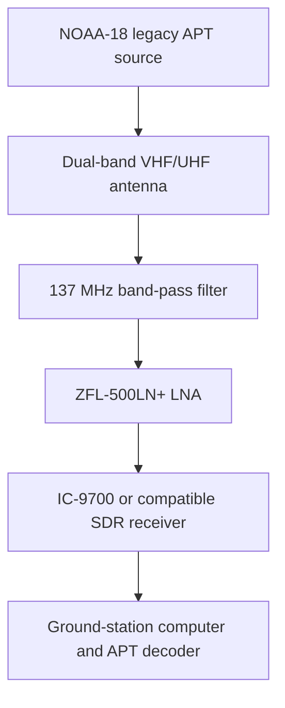
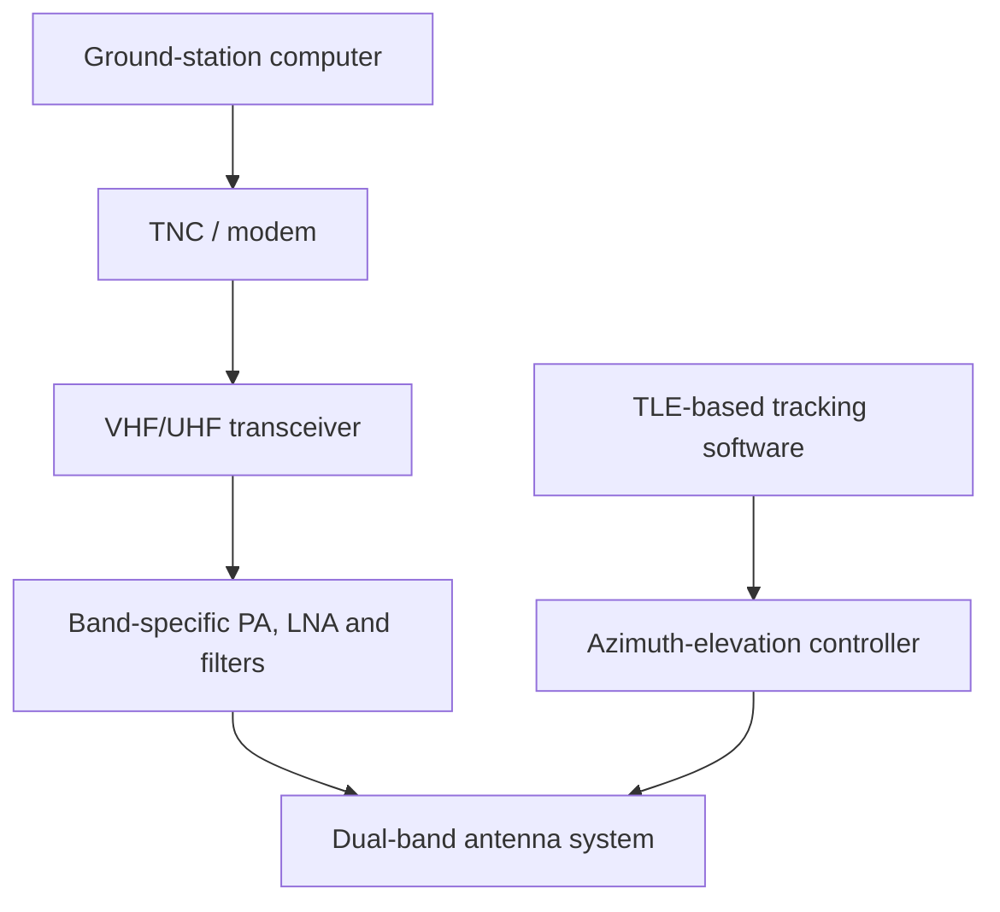

# System Architecture

## Reference VHF downlink

The reproducible reference case models legacy NOAA-18 APT reception at 137.9125 MHz.

The filter must match the active band. The BPF-BV435+ selected for the UHF path cannot be inserted into the 137.9125 MHz VHF path.

## Dual-band ground-station concept

The wider project architecture supports both receive-only analog VHF missions and bidirectional packet-radio missions. The mission profile determines which branch is active.

## Selected components from the design study

| Component | Design role |
|---|---|
| Diamond AZ-507FX | Dual-band VHF/UHF antenna |
| Yaesu G-5500 | Azimuth-elevation antenna positioning |
| Icom IC-9700 | VHF/UHF all-mode transceiver |
| Mobilinkd TNC4 | Packet modulation and demodulation for compatible digital links |
| ZFL-500LN+ | Low-noise receive amplification |
| ZHL-1-2W+ | RF power amplification for a compatible uplink path |
| BPF-BV435+ | UHF-band filtering near 435 MHz |
| Astron RS-70A | Regulated linear DC supply |

## Interface boundaries

- Tracking: TLE -> SGP4 -> AER -> rotor commands
- Receive path: antenna -> band-specific filter -> LNA -> receiver -> computer
- Packet transmit path: computer -> modem -> transceiver -> PA -> band-specific filter -> antenna
- Analysis: range and range rate -> FSPL, received power, C/N and Doppler

The current repository verifies orbital geometry and a reference VHF receive budget. It does not claim physical integration or on-air reception.
